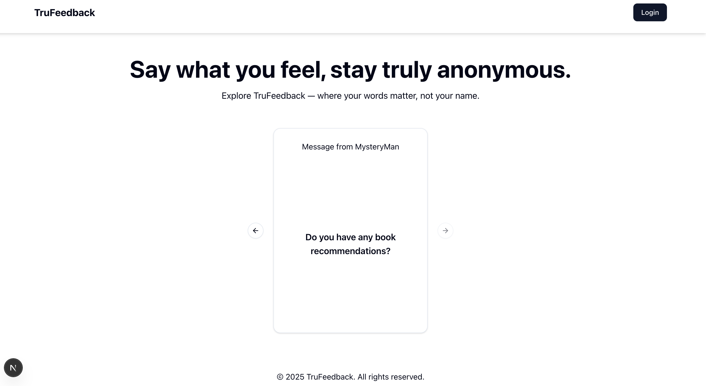
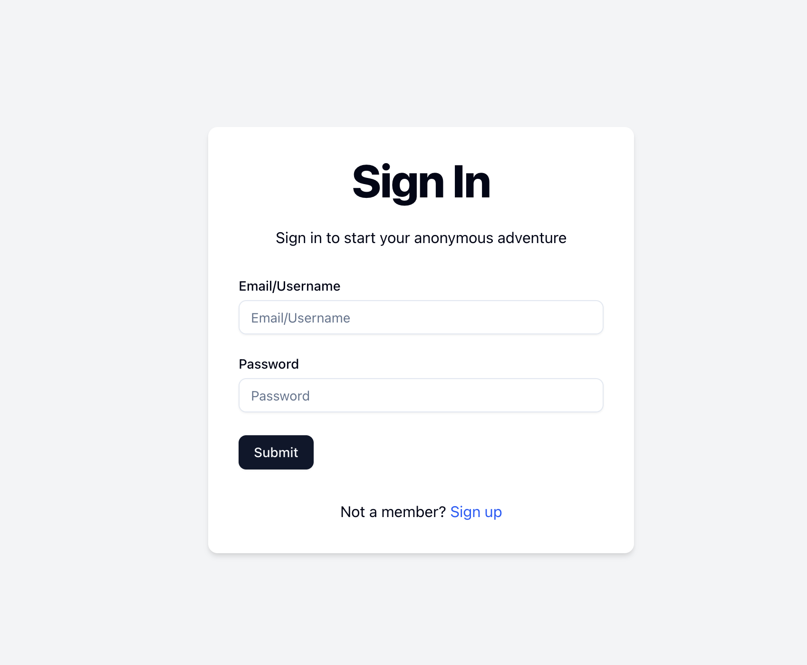
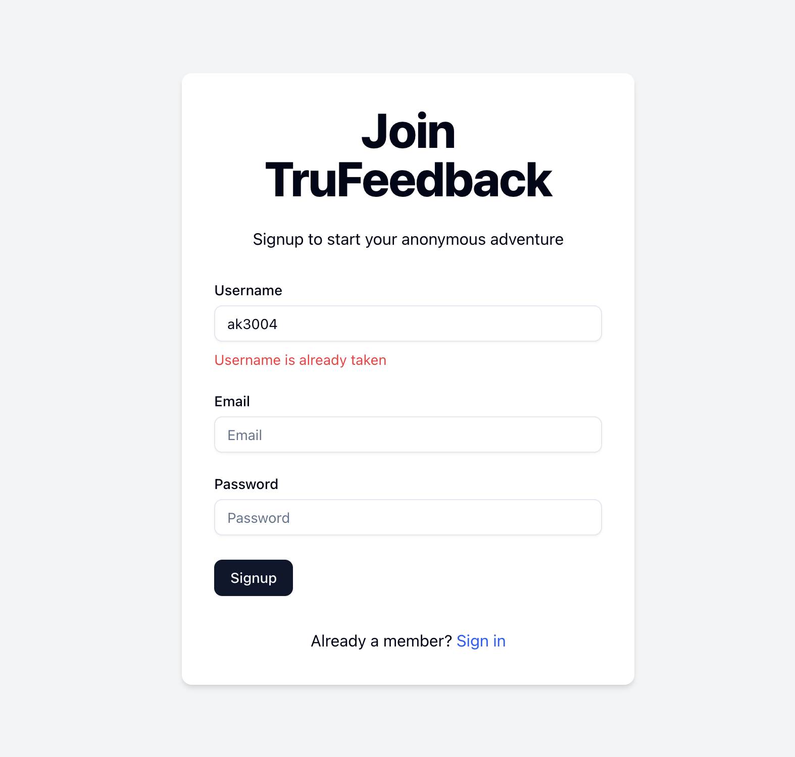
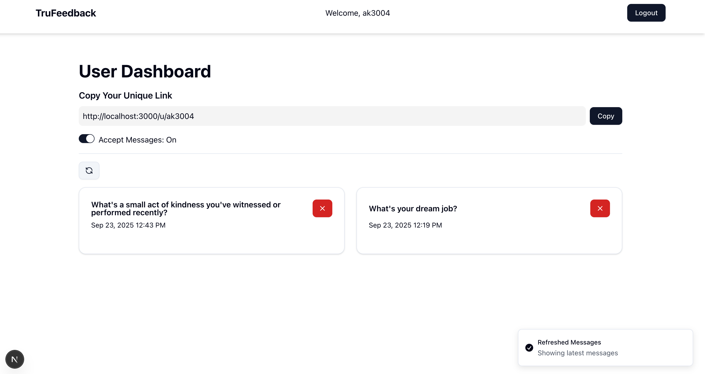
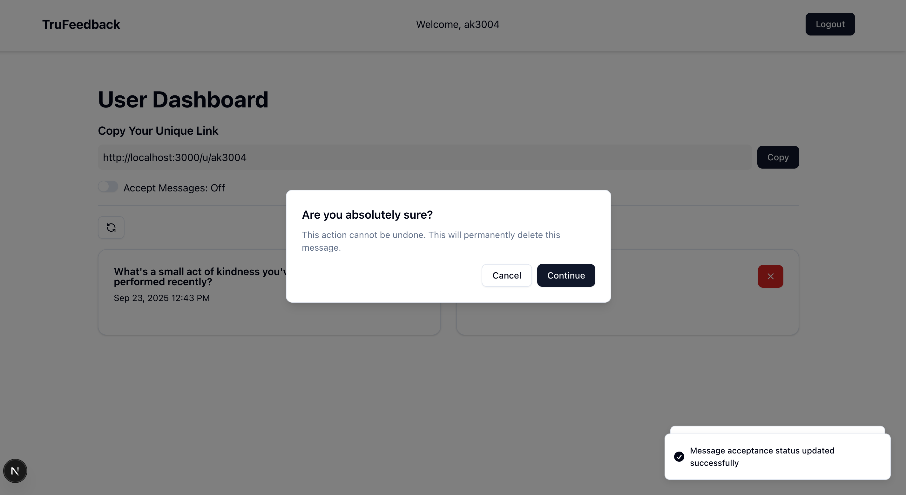
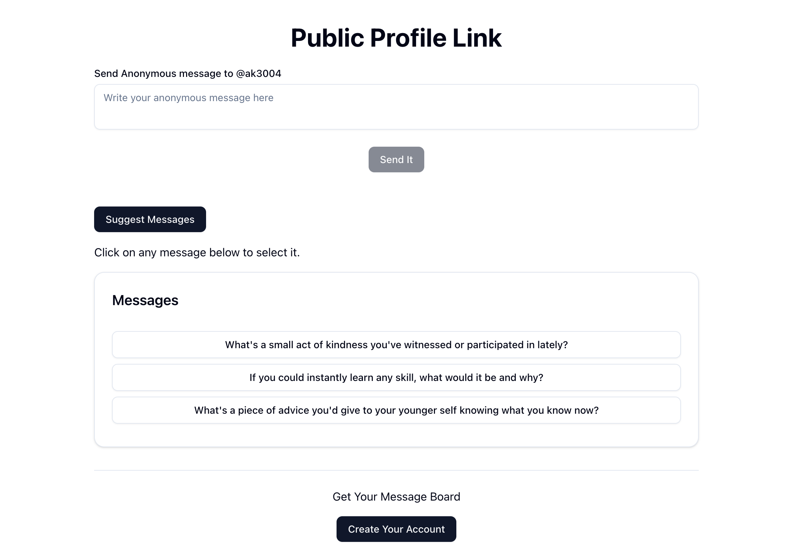

# TruFeedback - Anonymous Messaging Platform

TruFeedback is a modern full-stack web application that enables users to receive honest, anonymous messages from friends, colleagues, or followers. Users can create a secure account, share a public profile link, and let others send anonymous feedback. The platform also provides AI-generated suggestions to help senders craft meaningful messages. All received messages are stored securely, and users can accept, reject, or delete them from a personalized dashboard, making it an ideal tool for self-reflection, feedback collection, and engagement.

---

## Features

- **Anonymous Messaging:** Allows anyone with the public link to send messages anonymously without revealing their identity.
- **Public Profile Links:** Shareable profile URLs make it easy for others to send messages directly to the user’s dashboard.
- **AI-Powered Suggestions:** Provides top 3 AI-generated message suggestions for senders to inspire thoughtful feedback.
- **User Dashboard:** A clean interface to manage incoming messages with toggles to accept, reject, or delete messages.
- **Email Verification & Authentication:** Secure login with JWT-based sessions using NextAuth and Resend.
- **Message CRUD:** Full create, read, update, and delete functionality for messages.
- **Performance & SEO:** Optimized frontend with Shadcn UI components, form validations, achieving 96+ Lighthouse performance and 100 SEO score.
- **Responsive Design:** Mobile-first design ensures accessibility across devices.
- **Data Security:** Messages are securely stored in MongoDB and linked only to verified users.

---

## Tech Stack

- **Frontend:** Next.js, TypeScript, React, Shadcn UI  
- **Backend:** Next.js API Routes, MongoDB  
- **Authentication:** NextAuth, Resend (email verification)  
- **Form Validation:** react-hook-form, zod  
- **Deployment:** GitHub repository (local demo via setup)

---

## Screenshots

### Home Page
  
_Landing page with clear navigation to login or sign up._

### Login Page
  
_Secure login with email verification._

### Sign-Up Page
  
_Registration page for creating a secure account._

### User Dashboard
  
_Manage incoming messages, accept/reject using toggle switches._

### Delete Popup
  
_Deleting an anonymous message of the user._

### Public Profile Link Page
  
_Send anonymous messages and get AI-generated suggestions._

---